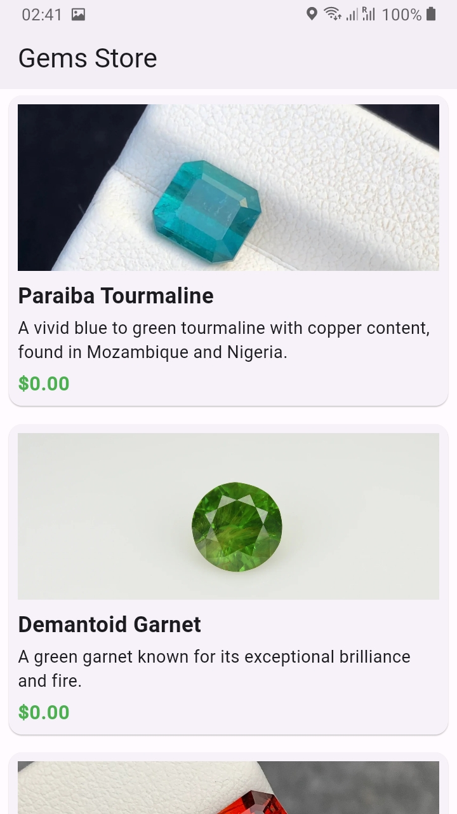
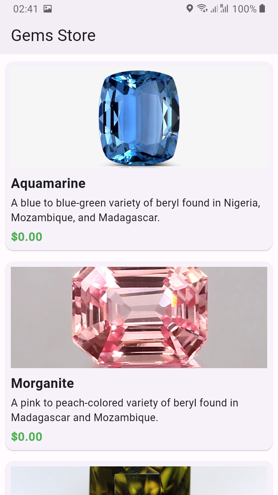

# Timbu API Integration Demo

This is an app demonstrating integration with the Timbu API for product retrieval and display.

## Features
- View a list of 10 products fetched from my account at Timbu API.
- Display product details including name, description, and image.
- Proper UI state management and error handling using Provider.

## Requirements
- Flutter SDK

## Screenshots

 

## Setup Instructions
1. Clone the repository:
   ```bash
   git clone https://github.com/shoully/shopping_app.git
   cd shopping_app