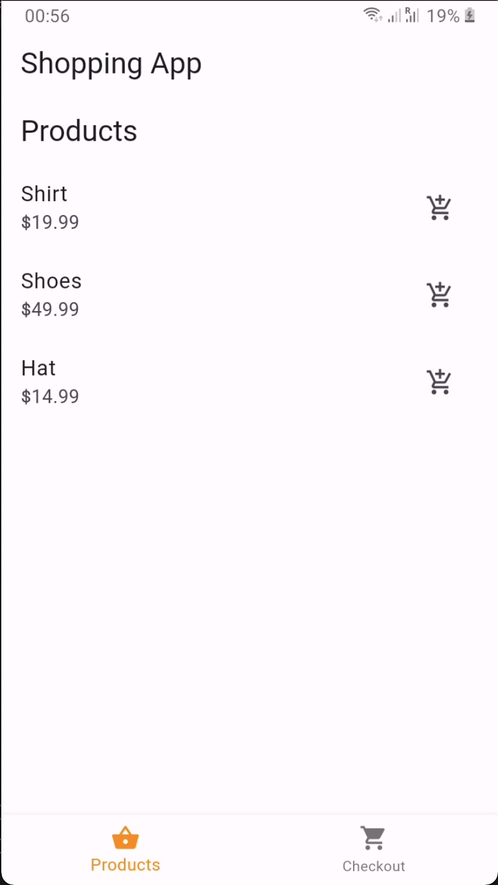
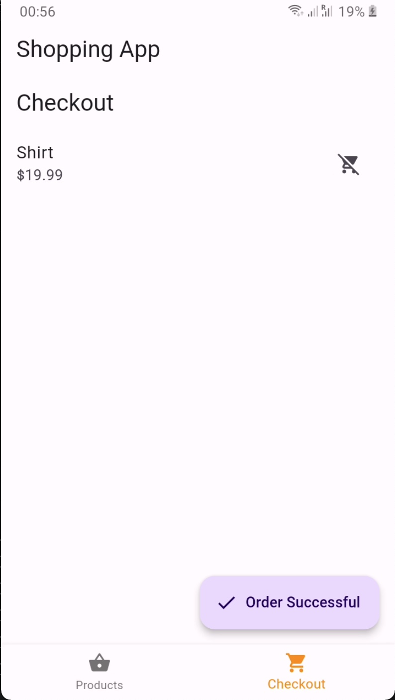
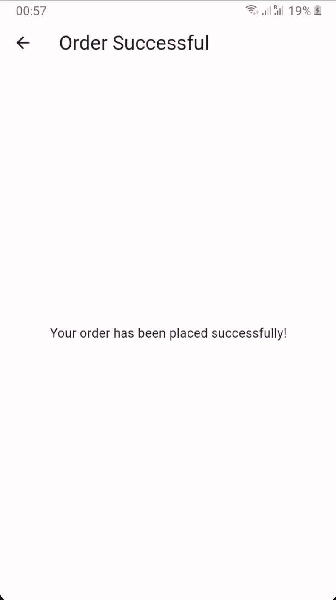

# Shopping App Demo

This is a simple shopping app demo built with Flutter as part of my participation of HNG internship  

## Features
- View a list of products.
- Add and remove products to/from the cart.
- Checkout and see an order success message.

## Requirements
- Flutter SDK

## Screenshots





## Setup Instructions
1. Clone the repository:
   ```bash
   git clone https://github.com/shoully/shopping_app.git